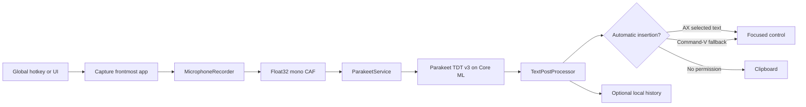

# Architecture

Sotto has an application shell and two reusable libraries. Product views depend
on `SottoCore` and `SottoDesignSystem`; neither library depends on the
application target.

## Dictation flow



`SottoAppModel` is the MainActor state machine for this flow. The model runtime
and JSON stores are actors. The Core Audio tap runs outside MainActor on the
realtime audio queue and copies samples into a preallocated
single-producer/single-consumer ring whose indices use C11 atomics. A dedicated
worker handles conversion, file I/O, metering, allocation and `AsyncStream`
delivery. Queue saturation becomes a recording error instead of silently
dropping words.

## Model lifecycle

`ParakeetService` owns one `AsrManager` and exposes these model states: checking,
absent, downloading, validating, loading, ready and failed. It pins
[FluidAudio 0.15.5](https://github.com/FluidInference/FluidAudio/tree/v0.15.5)
and requests the int8 Parakeet v3 Core ML artifacts.

The network is enabled only while `AsrModels.download` resolves and validates
the artifacts. Once the model loads, `ModelHub.offlineMode` is enabled. Normal
startup checks the expected files and loads only from the application support
directory. Every managed path component and model descendant rejects symbolic
links. Deletion is limited to the fixed model child folder, and a failed cache
can be deleted and reinstalled from the app.

The model lives outside the app bundle so upgrades do not duplicate it:

```text
~/Library/Application Support/Sotto/
├── Models/parakeet-tdt-0.6b-v3/
├── Recordings/                 transient crash-recovery scratch space
├── State/preferences.json
├── State/vocabulary.json
├── State/history.json
└── Logs/
```

Sotto removes the CAF file after a successful, cancelled or failed dictation.
At startup it also removes stale CAF files older than 24 hours while ignoring
unrelated files and symbolic links.

## Text insertion

Before requesting microphone permission, `TextInsertionService` remembers the
frontmost process, including its PID, bundle identifier, launch date and
executable URL. It revalidates that identity before sending AX or keyboard
events. The non-activating `NSPanel` shows status without stealing focus.
Insertion uses this ordered strategy:

1. Set `AXSelectedText` on the focused accessibility element.
2. If the pasteboard is empty, temporarily place the text there, reactivate the
   captured app and synthesize Command-V. The synthetic event is reported as an
   attempt because macOS cannot confirm that the target accepted it.
3. Leave the text copied if neither automatic route is available.

Every outcome is explicit (`inserted`, legacy `pasted`, `pasteAttempted`,
`copied`, `skipped`) and can be recorded in local history.

## Persistence and recovery

Sotto stores preferences, vocabulary and history as versioned, atomically
encoded JSON. Older records decode field by field, using defaults for new
values. When a file is malformed, Sotto moves it aside with a timestamped
`.corrupt-…json` name and loads defaults. This avoids a startup loop while
preserving the original file for recovery. Managed stores refuse a substituted
symlink parent. History is newest-first and bounded between 10 and 1,000
entries.

## Design system

The component source lives in the repository instead of a separate binary UI
dependency. Semantic colors, spacing, radii, typography, control sizes and
motion are injected once through `EnvironmentValues.sottoTheme`. See
[DesignSystem.md](DesignSystem.md).
