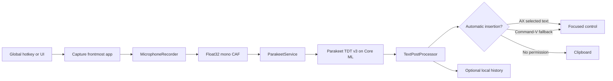

# Architecture

Sotto is split into an application shell and two reusable libraries. Product
views depend on `SottoCore` and `SottoDesignSystem`; neither library depends on
the application target.

## Dictation flow



`SottoAppModel` is the MainActor state machine coordinating this flow. The model
runtime and JSON stores are actors. The Core Audio tap runs outside MainActor on
the realtime audio queue and hands data to a locked sink; UI updates travel back
through a bounded `AsyncStream`.

## Model lifecycle

`ParakeetService` owns one `AsrManager` and exposes a finite model state:
checking, absent, downloading, validating, loading, ready or failed. It pins
[FluidAudio 0.15.5](https://github.com/FluidInference/FluidAudio/tree/v0.15.5)
and requests the int8 Parakeet v3 Core ML artifacts.

Installation allows the network only while `AsrModels.download` resolves and
validates the artifacts. Once loaded, `ModelHub.offlineMode` is enabled. Normal
startup inspects the exact expected files and loads only from the application
support directory. Deletion is constrained to that exact model child folder.

The model lives outside the app bundle so upgrades do not duplicate it:

```text
~/Library/Application Support/Sotto/
├── Models/parakeet-tdt-0.6b-v3/
├── Recordings/                 transient crash-recovery scratch space
├── State/preferences.json
├── State/vocabulary.json
├── State/history.json
└── Logs/
```

Successful, cancelled and failed dictations remove their CAF file. Startup also
removes stale CAF files older than 24 hours while ignoring unrelated files and
symbolic links.
