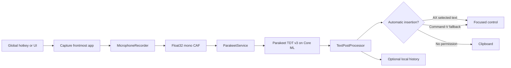

# Architecture

Sotto is split into an application shell and two reusable libraries. Product
views depend on `SottoCore` and `SottoDesignSystem`; neither library depends on
the application target.

## Dictation flow



`SottoAppModel` is the MainActor state machine coordinating this flow. The model
runtime and JSON stores are actors. The Core Audio tap runs outside MainActor on
the realtime audio queue. It copies into a preallocated single-producer/
single-consumer ring whose indices use C11 atomics; conversion, file I/O,
metering, allocation and `AsyncStream` delivery happen on a dedicated worker.
Queue saturation is an explicit recording error rather than silent word loss.

## Model lifecycle

`ParakeetService` owns one `AsrManager` and exposes a finite model state:
checking, absent, downloading, validating, loading, ready or failed. It pins
[FluidAudio 0.15.5](https://github.com/FluidInference/FluidAudio/tree/v0.15.5)
and requests the int8 Parakeet v3 Core ML artifacts.

Installation allows the network only while `AsrModels.download` resolves and
validates the artifacts. Once loaded, `ModelHub.offlineMode` is enabled. Normal
startup inspects the exact expected files and loads only from the application
support directory. Every managed path component and model descendant rejects
symbolic links. Deletion is constrained to the exact fixed model child folder,
and a failed cache has an explicit delete-and-reinstall recovery action.

The model lives outside the app bundle so upgrades do not duplicate it:

```text
~/Library/Application Support/Sotto/
├── Models/parakeet-tdt-0.6b-v3/
├── Recordings/                 transient crash-recovery scratch space
├── State/preferences.json
├── State/vocabulary.json
├── State/history.json
└── Logs/
```

Successful, cancelled and failed dictations remove their CAF file. Startup also
removes stale CAF files older than 24 hours while ignoring unrelated files and
symbolic links.

## Text insertion

Before requesting microphone permission, `TextInsertionService` remembers the
frontmost process, including PID, bundle identifier, launch date and executable
URL. It revalidates that identity before AX and keyboard events. A non-activating
`NSPanel` can therefore show status without stealing focus.
Insertion uses this ordered strategy:

1. Set `AXSelectedText` on the focused accessibility element.
2. If the pasteboard is empty, temporarily place the text there, reactivate the
   captured app and synthesize Command-V. The synthetic event is reported as an
   attempt because macOS cannot confirm that the target accepted it.
3. Leave the text copied if neither automatic route is available.

Every outcome is explicit (`inserted`, legacy `pasted`, `pasteAttempted`,
`copied`, `skipped`) and can be recorded in local history.

## Persistence and recovery

Preferences, vocabulary and history are versioned, atomically encoded JSON.
Older records decode field by field with defaults for newly introduced values.
A malformed file is moved aside with a timestamped `.corrupt-…json` name and
defaults are loaded, avoiding a startup loop while preserving evidence for
recovery. Managed stores refuse a substituted symlink parent. History is
newest-first and bounded between 10 and 1,000 entries.

## Design system

The component source is owned by the repository, like shadcn/ui rather than a
binary UI dependency. Semantic colors, spacing, radii, typography, control sizes
and motion are injected once through `EnvironmentValues.sottoTheme`. See
[DesignSystem.md](DesignSystem.md).
