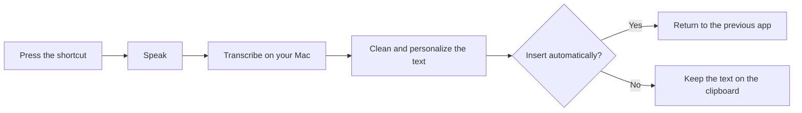

# Sotto

<p align="center">
  <strong>Speak. Sotto types.</strong><br>
  Native dictation for macOS that keeps you in the app you are already using.
</p>

<p align="center">
  <a href="https://github.com/t5victor/Sotto/actions/workflows/ci.yml"></a>
  <a href="https://www.apple.com/macos/sonoma/"></a>
  <a href="https://www.swift.org/"></a>
  <a href="LICENSE"></a>
  <a href="https://ko-fi.com/t5victor"></a>
</p>

<p align="center">
  
</p>

<p align="justify">
Sotto turns your voice into clean text in the app where you are working. Press a
shortcut, speak, release, and continue. Sotto remembers the app that was in
front, processes the recording, improves the text, and inserts it into the
focused field. If automatic insertion is unavailable, the finished text stays
ready on the clipboard.
</p>

## Why Sotto

| | What you get |
| --- | --- |
| **A short path from voice to text** | Hold <kbd>⌥</kbd> <kbd>Space</kbd> by default, speak, release, and keep moving. Toggle mode is available too. |
| **A focused desktop experience** | A menu bar control and a quiet overlay show state without pulling you away. Light and dark themes, compact controls, and Reduce Motion support keep the surface calm. |
| **Text that sounds like you** | Add vocabulary replacements, remove filler sounds, and normalize spacing and punctuation. |
| **A safe fallback** | Sotto tries direct insertion first, then paste, then leaves the result copied when macOS cannot insert it. |
| **Useful history, when you want it** | Keep a bounded list of recent dictations, or turn history off. Audio recordings are temporary and are not stored in history. |

## How it works



The first model download needs an internet connection. Once the model is ready,
dictation itself does not make a network request. Sotto has no account system,
advertising SDK, analytics pipeline, telemetry endpoint, or cloud transcription
service.

## Try it

Sotto currently runs on Apple Silicon Macs with macOS 14 or newer. The speech
model needs roughly 500 MB of free disk space and is downloaded separately from
the application bundle.

### Install from source

You need Xcode 16 or newer.

```sh
git clone https://github.com/t5victor/Sotto.git
cd Sotto
swift package resolve
Scripts/build-app.sh release local
open dist/Sotto.app
```

### Install with Homebrew

Once a GitHub Release is available, this repository can also be used directly
as a custom Homebrew tap:

```sh
brew tap t5victor/sotto https://github.com/t5victor/sotto.git
brew install --cask sotto
```

The Cask lives in [`Casks/sotto.rb`](Casks/sotto.rb). Because the release is
ad-hoc signed rather than notarized, macOS may require you to choose **Open**
explicitly the first time you launch Sotto.

Releases are published from the `releases` branch. Push a commit whose first
line is simply `cask`; the workflow increments the version everywhere, updates
the Cask checksum, synchronizes `releases` and `main`, and creates the GitHub
Release automatically. The counter advances through `1.0.0`, `1.0.1`, …,
`1.0.10`, then rolls over to `1.1.0`.

### First launch

1. Open **Motor de voz** (Voice Engine) and install the speech engine.
2. Allow **Microphone** access so Sotto can hear you.
3. Allow **Accessibility** if you want Sotto to insert text into the active app.
   Without it, Sotto copies the completed text instead.
4. Hold <kbd>⌥</kbd> <kbd>Space</kbd>, speak, and release. Turn off **Mantener
   para dictar** in **Atajos** (Shortcuts) to use the same shortcut as a toggle.

Sotto captures the destination app before it asks for permission or shows the
overlay. A permission dialog or the overlay cannot accidentally become the
place where your words are inserted.

## What you can customize

- **Vocabulary:** map the way a name sounds to the spelling you want.
- **Text cleanup:** normalize punctuation and remove unambiguous filler sounds.
- **Shortcuts:** choose a global shortcut and hold-to-talk or toggle behavior.
- **History:** keep recent dictations, or disable it.
- **Startup:** launch Sotto when you sign in to your Mac.
- **Insertion:** use Accessibility insertion when available, with pasteboard
  fallback when it is not.

<details>
<summary>Supported languages</summary>

Bulgarian, Croatian, Czech, Danish, Dutch, English, Estonian, Finnish, French,
German, Greek, Hungarian, Italian, Latvian, Lithuanian, Maltese, Polish,
Portuguese, Romanian, Russian, Slovak, Slovenian, Spanish, Swedish, and
Ukrainian.

</details>

## Privacy in plain language

<p align="justify">
Sotto stores its preferences, vocabulary, optional history, temporary recordings,
and downloaded speech model under <code>~/Library/Application Support/Sotto</code>.
Temporary recordings are deleted after success, failure, or cancellation, and
crash leftovers older than 24 hours are cleaned up at startup. History contains
text and dictation metadata, never audio.
</p>

| Permission or data | What it is used for |
| --- | --- |
| **Microphone** | Captures the speech you choose to dictate. |
| **Accessibility** | Inserts text into the app that was active before dictation began. It is optional. |
| **Pasteboard** | Provides a fallback when direct insertion is not available. |
| **History** | Stores recent text only when you enable it. |
| **Launch at login** | Makes Sotto available when you sign in. |

You can remove the downloaded speech engine and delete history from Sotto's
settings. Sotto also rejects unexpected symbolic links inside its managed data
folders before reading, writing, or deleting files.

## Build and test

For contributors and people who want to build their own copy:

```sh
swift test
swift build -c release --product Sotto
Scripts/build-app.sh release local
```

The package includes the macOS app, menu bar control, dictation overlay,
diagnostic CLI, reusable UI components, and automated tests. A local build is
ad-hoc signed for development. Public distribution requires a separate
Developer ID and notarization setup. The test suite covers realtime audio
buffering, text processing, insertion fallback, persistence recovery, model
cache safety, and accessible design tokens.

## License and credits

Sotto is released under the [Apache License 2.0](LICENSE).

Sotto uses FluidAudio under Apache 2.0 and NVIDIA Parakeet TDT 0.6B v3 under
[CC BY 4.0](https://creativecommons.org/licenses/by/4.0/). Inter and JetBrains
Mono are distributed under the SIL Open Font License. Full attribution and
third-party notices are available in
[`THIRD_PARTY_NOTICES.md`](THIRD_PARTY_NOTICES.md) and are included with the
application bundle.

Questions, bug reports, and feedback are welcome in the
[GitHub issue tracker](https://github.com/t5victor/Sotto/issues).
