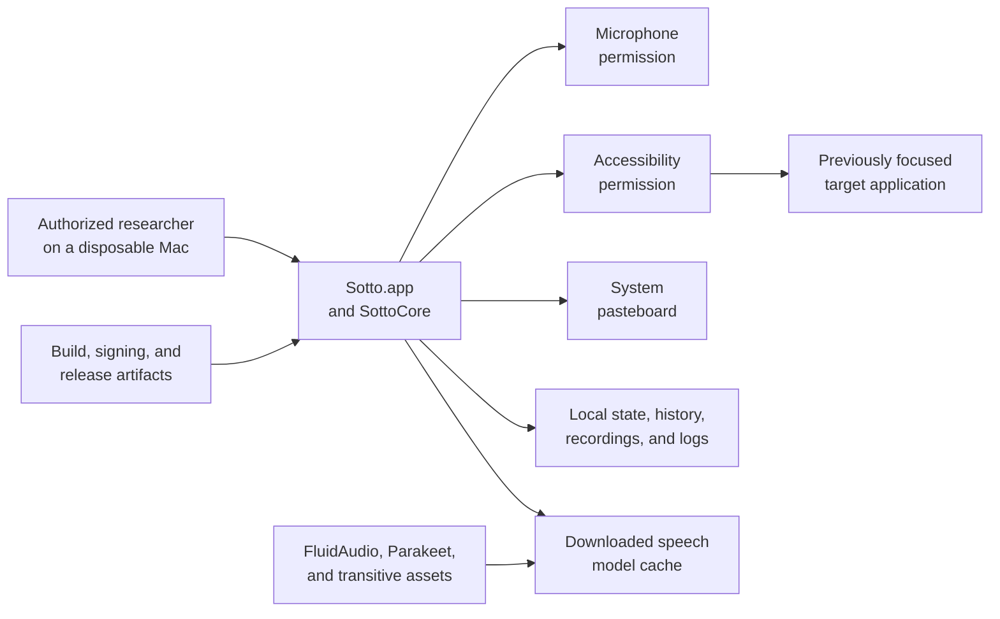
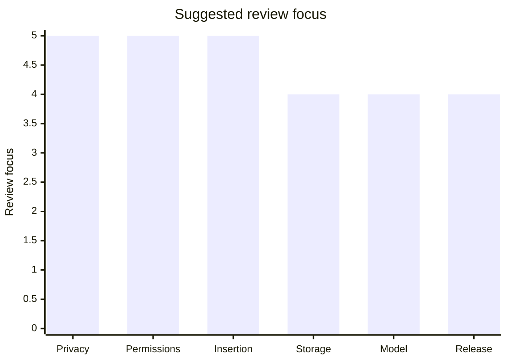
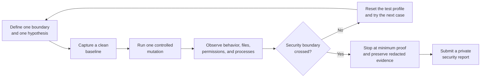

<div align="center">

# Sotto Security

**Break the boundary. Protect the person.**

A practical security policy for a local-first macOS voice tool.

[](README.md)
[](Package.swift)
[](README.md)
[](#report-a-vulnerability)

</div>

> **We want you to try to break Sotto.**
>
> A strong security report gives us a small, repeatable experiment that crosses
> a meaningful boundary, identifies who can cross it, and includes enough
> evidence to reproduce it without exposing anyone's data.

This document covers vulnerability research against Sotto, its macOS packaging,
and the security-sensitive code in this repository. It is for contributors,
maintainers, security researchers, and anyone willing to keep pressing the
product until it fails.

## Security at a glance

| Property | Sotto's current boundary |
| --- | --- |
| Product | Native macOS 14+ menu-bar application |
| Primary asset | User voice, transcript text, vocabulary, and history |
| Audio path | Captured temporarily on the Mac and removed after processing or cancellation |
| Transcription | Local after the speech model is installed; no account or cloud transcription service |
| Network path | The initial speech-model download and its dependency-managed assets |
| Sensitive permissions | Microphone; optional Accessibility for insertion into the previously focused app |
| Fallback channel | The system pasteboard when direct insertion is unavailable |
| Managed data | `~/Library/Application Support/Sotto` |
| Preferred report channel | A private GitHub Security Advisory |

### The boundary map



Use the chart to organize review. Treat each value as a review priority and
validate actual findings with evidence. A report becomes valuable when it shows
that an untrusted input, process, file, permission transition, or release
artifact can cross one of these edges in an unexpected way.

### Suggested attack priority

When time is limited, use this as a focus guide. Treat the values as review
priorities, then rate actual findings with the evidence and severity model
below.



## Supported versions

| Version or branch | Security fixes |
| --- | --- |
| Latest published release | Yes |
| `main` | Best effort; report against the exact commit |
| Older releases | Not guaranteed; upgrade before testing where possible |

If a report affects a release candidate, a Homebrew artifact, or a locally
built app, include the exact version, commit, and artifact hash. A local
ad-hoc build and a publicly distributed, notarized build are different trust
boundaries.

## What is in scope

Test the product and repository surfaces that Sotto controls:

- `Sotto.app`, `SottoCore`, `SottoDoctor`, and the Swift package targets in
  this repository.
- Permission and consent behavior for Microphone and Accessibility, including
  denial, revocation, relaunch, cancellation, and race conditions.
- Focused-app capture and text insertion through Accessibility or the
  pasteboard fallback.
- Temporary recordings, JSON state, history, projects, vocabulary, logs, and
  cleanup under `~/Library/Application Support/Sotto`.
- Path validation, symbolic-link handling, corrupt or partial state, and
  deletion boundaries in managed directories.
- Speech-model installation, interruption, cache integrity, reload, removal,
  and the way downloaded assets enter the application.
- Resource exhaustion and reliability issues that a local user can trigger:
  hotkey storms, rapid cancellation, malformed input, repeated retries, and
  unbounded memory, CPU, disk, or microphone use.
- Build scripts, entitlements, dependency pinning, application contents,
  signing, and release packaging where a flaw could affect a user of Sotto.
- Sensitive information exposed in user-visible errors, diagnostics, crash
  artifacts, logs, or generated release files.

## What is not in scope

Do not use Sotto as a pretext to attack systems that are not yours or that this
repository does not control. The following are out of scope unless they reveal
a Sotto-specific vulnerability:

- Apple services, macOS itself, GitHub, Homebrew, FluidAudio, NVIDIA, or any
  other upstream provider.
- Social engineering, phishing, impersonation, credential theft, malware,
  persistence, or physical compromise of another person's Mac.
- Accessing, modifying, or exfiltrating another user's files, microphone,
  transcript, clipboard, account, or device.
- Denial-of-service testing against shared infrastructure or third-party
  endpoints. Stress your own disposable machine at a conservative rate.
- Findings that require a device already fully compromised by an attacker,
  unless the finding materially increases privilege, persistence, or access to
  Sotto's protected data.
- Cosmetic defects, ordinary crashes with no security impact, or hardening
  suggestions that do not describe a plausible abuse path. These are still
  welcome as normal issues when reported through the issue tracker.

## The rules of engagement

1. **Test only what you own or are explicitly authorized to test.** A local
   checkout and a Mac you control are the default safe lab.
2. **Use a disposable macOS user, test data, and a separate build.** Never put
   real conversations, credentials, customer data, or production secrets into
   a reproduction.
3. **Prefer controlled mutations over uncontrolled automation.** Change one
   variable at a time: permission state, focus target, file contents, model
   cache, process lifetime, or timing.
4. **Stop at the first proof of impact.** After proving that one test
   transcript can be read, preserve only the evidence needed to demonstrate
   the boundary crossing.
5. **Do not publish or weaponize an unpatched issue.** Report privately first
   and coordinate disclosure with the maintainers.
6. **Do not plant payloads in upstream infrastructure.** If a test touches a
   download, dependency, release, or signing flow, use local fixtures or a
   private fork that you control.
7. **Redact aggressively.** Screenshots, logs, terminal output, and archives
   must not contain real audio, transcript text, clipboard contents, tokens,
   private paths, or signing material.

Good-faith mistakes made inside this policy are part of research. We will not
ask for legal action against a researcher who follows these rules, reports
privately, and does not use the finding to harm people. This safe harbor does
not authorize testing of third-party systems and cannot override their terms.

## What we want you to break

Focus on tests that challenge a user expectation and a security boundary at the
same time.

| Area | Try to prove | A strong result looks like |
| --- | --- | --- |
| Microphone lifecycle | Audio remains captured after cancel, stop, permission revocation, or app termination | A test can reproduce continued capture, an undeleted recording, or a permission bypass |
| Target application | Text lands in the wrong app after focus changes, process reuse, relaunch, or a delayed insertion | A transcript crosses into a target the user did not choose |
| Accessibility | A permission transition or UI race permits unintended interaction with another app | Sotto reads or changes more than the user consented to, with a repeatable sequence |
| Pasteboard | A failed insertion leaks transcript text, loses sensitive prior contents, or leaves data behind unexpectedly | A controlled failure demonstrates disclosure, corruption, or unsafe restoration |
| Local storage | A crafted path, symlink, corrupt JSON file, or partial state escapes Sotto's managed root | Sotto reads, writes, or deletes outside its own data directory |
| History and privacy | History-disabled mode, cleanup, crash recovery, or logs still retain sensitive text/audio | A test finds retained data and identifies exactly where it persists |
| Model supply chain | A partial, replaced, or malformed model cache is trusted, executed, or used to escape the expected boundary | Tampered local assets change security behavior or cause unsafe file/process access |
| Availability | Repeated hotkeys, long recordings, malformed audio, cancellation races, or failed downloads exhaust a resource | A local user can cause persistent lock-up, runaway disk use, or an unrecoverable state |
| Diagnostics | `SottoDoctor` or user-visible errors disclose sensitive values or perform unsafe actions | A low-privilege test gets secrets, raw content, or a destructive side effect |
| Release integrity | Build scripts, entitlements, bundled files, or signing steps produce a materially less trustworthy app | A release artifact has an unexpected capability, executable, dependency, or trust state |

### A safe attack loop



## Severity model

Rate severity from demonstrated impact. If you are unsure, report the facts and
let us calibrate the severity together.

| Priority | Meaning | Examples in Sotto |
| --- | --- | --- |
| **P0 — Critical** | A practical path to code execution, broad data exfiltration, privilege escalation, or malicious release impact without a reasonable user safeguard | An untrusted model or release artifact executes in Sotto's context; an attacker can silently obtain arbitrary users' transcripts or audio |
| **P1 — High** | A reliable breach of a high-value local boundary with meaningful user harm | Transcript insertion into an unintended app, persistent microphone capture, arbitrary file deletion outside Sotto's root, or a permission bypass |
| **P2 — Moderate** | A real but constrained disclosure, integrity, availability, or consent failure | Local transcript disclosure with a plausible additional precondition, tampered history/model state, or a repeatable resource exhaustion issue |
| **P3 — Low** | Limited impact or defense-in-depth weakness | Sensitive metadata in a diagnostic path, a low-impact privacy leak, or a hardening gap with no demonstrated exploit |

The following are usually not security vulnerabilities by themselves: a
transcription error, a normal insertion failure that falls back to copying,
an expected permission prompt, a crash with no sensitive data or privilege
impact, or a finding that exists only in an unsupported and materially altered
environment. Include the environment anyway; it may change the assessment.

## Report a vulnerability

### Preferred channel: private disclosure

Use [GitHub's private security advisory form](https://github.com/t5victor/Sotto/security/advisories/new).
Please do not open a public issue with exploit details.

If the advisory form is unavailable, open a public issue with only the title
`SECURITY: private contact requested` and no reproduction or sensitive detail.
We will move the conversation to a private channel.

### Minimum useful report

```markdown
## Summary
One sentence describing the boundary crossed.

## Impact
What an attacker or local process can gain, change, or prevent.

## Preconditions
Required permissions, user actions, files, processes, or access level.

## Environment
- Sotto version or commit:
- macOS version:
- Mac model / architecture:
- Build source: release, Homebrew, or local build
- Relevant permission state:

## Reproduction
1. Start from a clean test profile.
2. ...
3. ...

## Expected / actual behavior
- Expected:
- Actual:

## Evidence
Attach only redacted logs, screenshots, or a minimal fixture.

## Suggested fix
Optional. A precise mitigation is welcome, but proof and impact matter more.
```

Please include the smallest fixture that reproduces the issue. Do not attach
real voice recordings or transcript text; synthetic audio and placeholder
strings are better evidence.

## Response and disclosure

Maintainer targets only; they are not contractual commitments:

| Stage | Target | What happens |
| --- | --- | --- |
| Acknowledge | Within 2 business days | We confirm receipt and establish a private point of contact |
| Initial triage | Within 5 business days | We reproduce where possible, assign priority, and identify affected versions |
| Mitigation | As fast as practical for P0/P1 | We may ship a fix, configuration guidance, or a temporary containment step |
| Fix and release | Coordinated with the reporter | We credit the researcher when requested and document the affected versions |
| Disclosure | Agreed case by case | We prefer a coordinated timeline after users have a meaningful mitigation |

If we cannot reproduce the report, we will explain what evidence is missing or
what environmental difference matters. A report is not downgraded merely because
the first reproduction attempt failed.

## Release security bar

Passing tests is one release gate. Before calling a build ready for public
distribution, maintainers should have evidence for each of these gates:

| Gate | Expected evidence |
| --- | --- |
| Source | Review of the release diff, debug controls, generated files, and dependency changes |
| Permissions | Microphone and Accessibility behavior tested when granted, denied, revoked, and interrupted |
| Data handling | Temporary recordings are cleaned up; history settings are honored; logs and errors are redacted |
| Filesystem | Managed paths reject traversal and symbolic-link substitution; cleanup cannot escape Sotto's root |
| Dependencies | `Package.resolved`, third-party notices, and downloaded model provenance are reviewed |
| Artifact | Bundle contents, `Info.plist`, entitlements, architecture, and executable set are inspected |
| Trust | Public builds use the intended Developer ID signing and notarization path; ad-hoc signing is treated as local-only evidence |
| Runtime | A clean-machine launch, permission journey, dictation, insertion fallback, model install, and uninstall/cleanup path are exercised |

A green unit-test suite, a successful local build, or a valid ZIP is useful
evidence. Public readiness also requires proof of Gatekeeper acceptance,
notarization, and safe behavior on a clean Mac.

## Contributor security bar

When changing security-sensitive code, keep the product quiet and predictable:

- Keep raw audio and transcript text out of logs, analytics, diagnostics, and
  error strings unless a test explicitly uses synthetic data.
- Treat Microphone, Accessibility, the pasteboard, local state, and downloaded
  models as separate trust boundaries.
- Add tests for denial, revocation, cancellation, process replacement, corrupt
  state, partial downloads, symbolic links, and concurrent cleanup where the
  change touches those paths.
- Keep file operations contained to Sotto-owned directories and validate the
  path immediately before sensitive reads, writes, or deletes.
- Do not add network calls, telemetry, persistence, login items, or entitlements
  without documenting the new data flow and threat model.
- Never let a debug-only control survive into a release UI or release behavior.
- Update [`THIRD_PARTY_NOTICES.md`](THIRD_PARTY_NOTICES.md) when dependency or
  bundled-asset changes require it.

## Recognition

We are happy to credit researchers in the changelog, release notes, or this
policy, subject to your preference. Tell us the name or handle you would like
used and whether you want a link. Anonymous reports are equally welcome.

<sub>Policy maintained with the project. Last reviewed: 2026-08-13.</sub>
